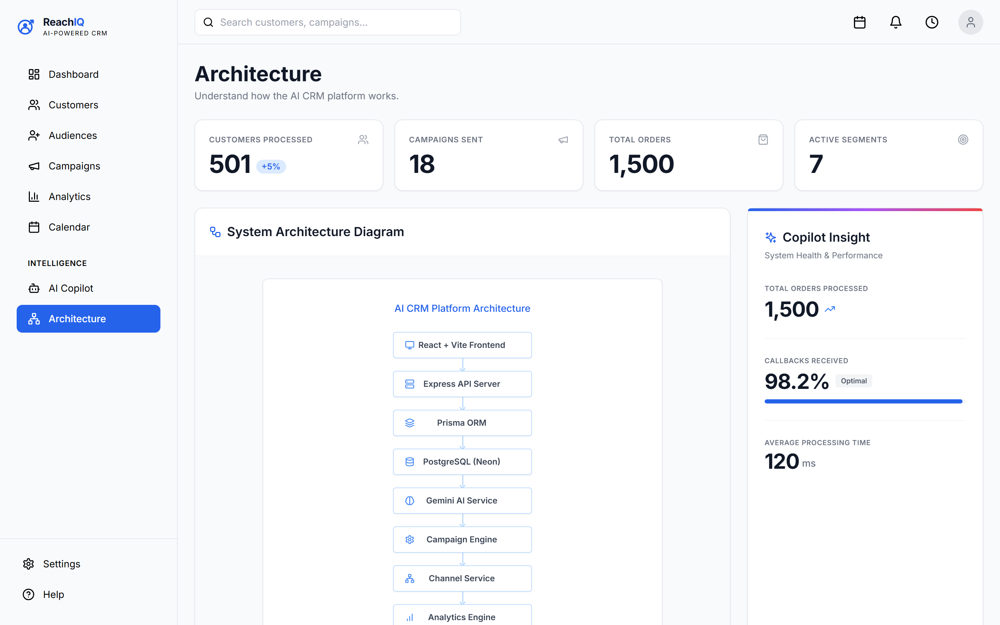
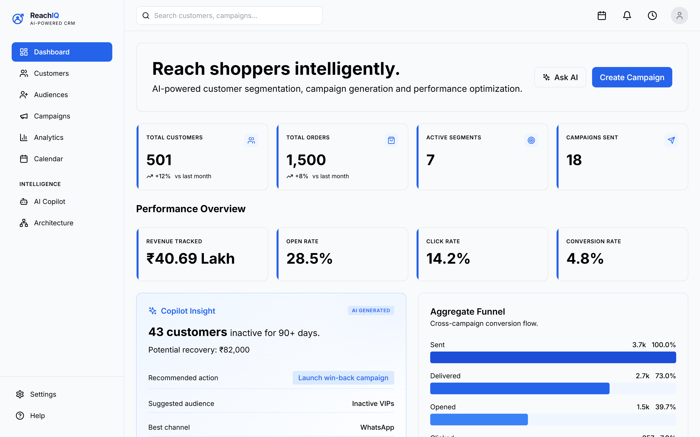
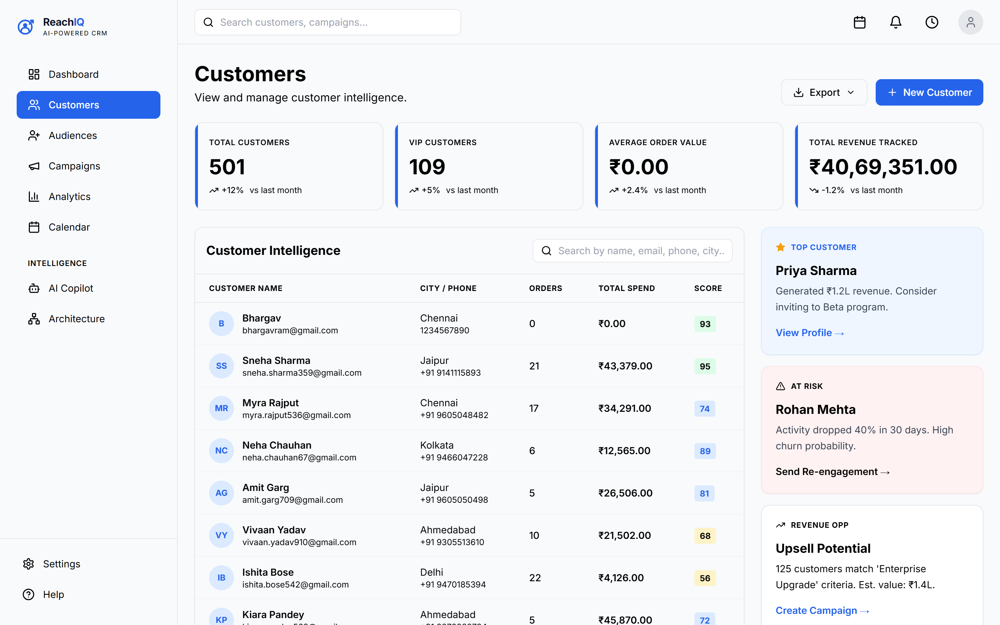
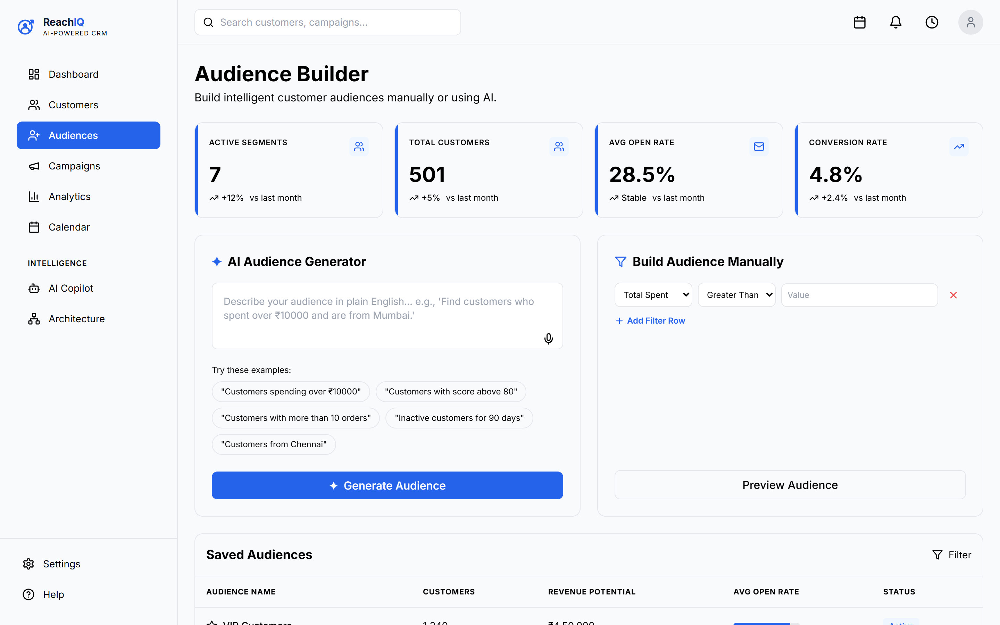
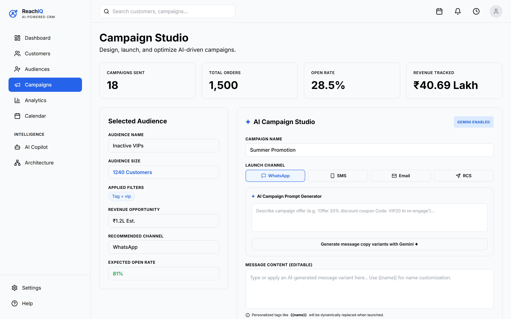
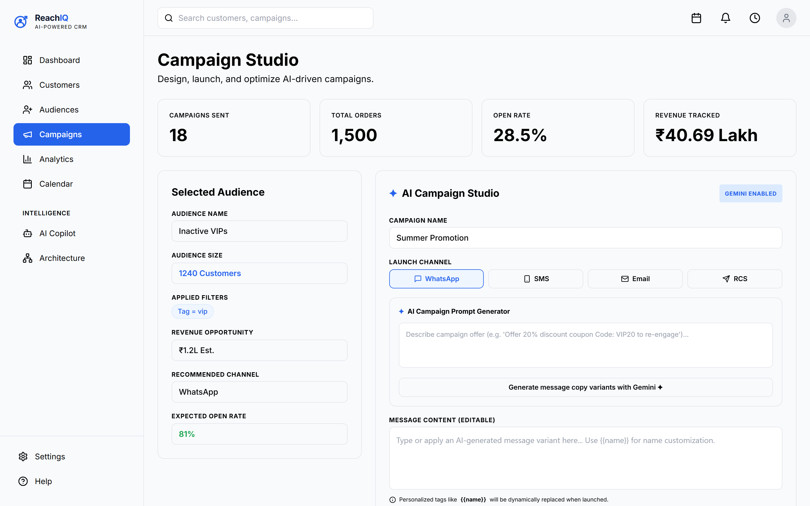
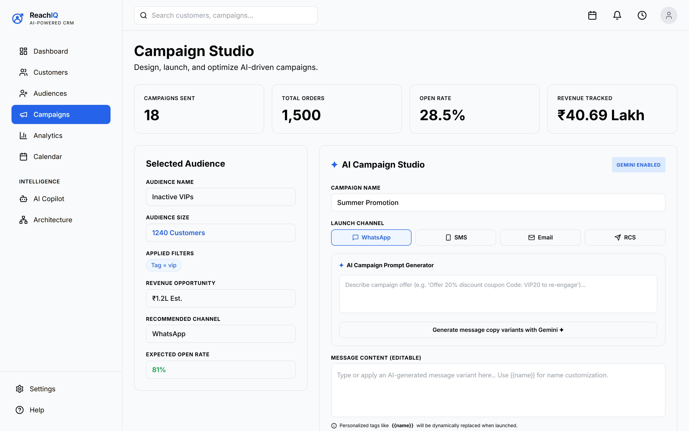
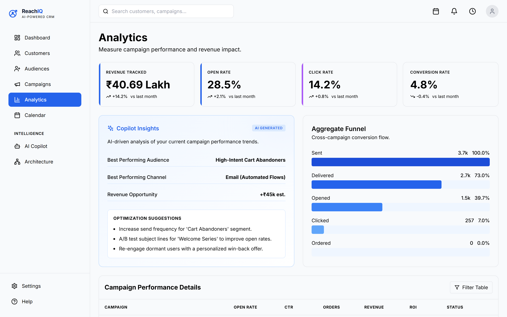
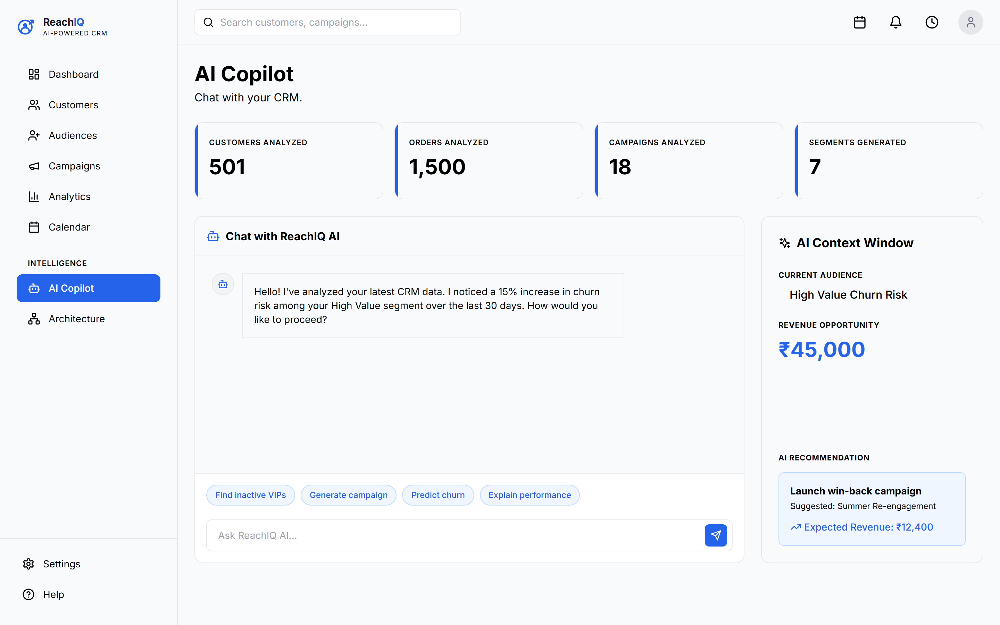

# ReachIQ – AI Native CRM

## Overview

ReachIQ is an AI-powered Customer Relationship Management (CRM) platform designed for modern D2C brands.

Instead of relying on manual segmentation and campaign creation, ReachIQ enables marketers to:

* Discover high-value customer segments using AI
* Generate personalized campaign content automatically
* Launch campaigns across multiple channels
* Track campaign performance through analytics
* Receive AI-generated recommendations and insights

The goal of ReachIQ is to help marketers decide:

* Who to target
* What message to send
* Which channel to use
* How to improve campaign performance

---

## Problem Statement

Traditional CRM platforms provide customer data but require marketers to manually analyze audiences, write campaigns, and interpret reports.

ReachIQ solves this by introducing an AI-first workflow where intelligence is built into every stage of the customer engagement lifecycle.

---

# Core Features

### Customer Management

* Customer Profiles
* Customer Intelligence Dashboard
* Customer Search & Filtering
* Revenue Tracking
* Customer Scoring

### Audience Builder

* AI Audience Generator
* Natural Language Segmentation
* Manual Filter Builder
* Audience Preview
* Audience Saving

Example prompts:

* Customers spending over ₹10000
* VIP customers inactive for 90 days
* Fashion buyers from Chennai

---

### Campaign Studio

* Audience Selection
* Multi-channel Campaign Creation
* WhatsApp Campaigns
* SMS Campaigns
* Email Campaigns
* AI Campaign Copy Generation
* Personalized Message Variants

---

### Analytics Dashboard

* Campaign Performance Tracking
* Delivery Funnel
* Open Rate Analysis
* Click Rate Analysis
* Conversion Tracking
* AI Performance Insights

---

### AI Copilot

AI-powered assistant capable of:

* Customer intelligence queries
* Audience recommendations
* Campaign suggestions
* Performance explanations

---

## Technology Stack

### Frontend

* React
* Vite
* Tailwind CSS
* React Router

### Backend

* Node.js
* Express.js
* Prisma ORM

### Database

* PostgreSQL (Neon)

### AI Layer

* Google Gemini API

### Deployment

* Frontend → Vercel
* Backend → Railway

---

# System Architecture

User
↓
React Frontend
↓
Express Backend
↓
Gemini AI + PostgreSQL
↓
Campaign Engine
↓
Analytics & Insights

---

---

# Product Walkthrough

Here is a visual overview of the ReachIQ platform:

### Dashboard

### Customers

### Audience Builder

### Audience Preview

### Campaign Creation

### AI Message Generation

### Campaign Launch

### Campaign Analytics

### AI Copilot

---

# End-to-End Workflow

## Step 1 – Customer Intelligence

View customer data, spending patterns, engagement metrics, and customer scores.

---

## Step 2 – Audience Creation

Generate audiences using natural language prompts or manual filters.

Example:

"Customers spending over ₹10000"

---

## Step 3 – Audience Preview

Preview matching customers before campaign launch.

---

## Step 4 – Campaign Creation

Create a campaign and choose communication channels.

---

## Step 5 – AI Message Generation

Generate multiple personalized campaign variants using Gemini AI.

---

## Step 6 – Campaign Launch

Launch campaign to selected audience.

---

## Step 7 – Campaign Analytics

Monitor campaign delivery and engagement metrics.

---

## Step 8 – AI Insights

Receive AI-generated recommendations and performance summaries.

---

# Project Highlights

* AI-Native CRM
* Natural Language Audience Builder
* AI Campaign Generation
* Multi-Channel Messaging
* Real-Time Analytics
* Customer Intelligence Platform
* Modern React Dashboard
* Cloud-Native Deployment

---

# Future Enhancements

* Real WhatsApp Business API Integration
* Real Email Provider Integration
* Predictive Churn Detection
* Customer Lifetime Value Forecasting
* AI Recommendation Engine
* Marketing Automation Workflows

---

## Author

Bhargav Ram G

SRM Institute of Science and Technology

B.Tech CSE – Cyber Security
